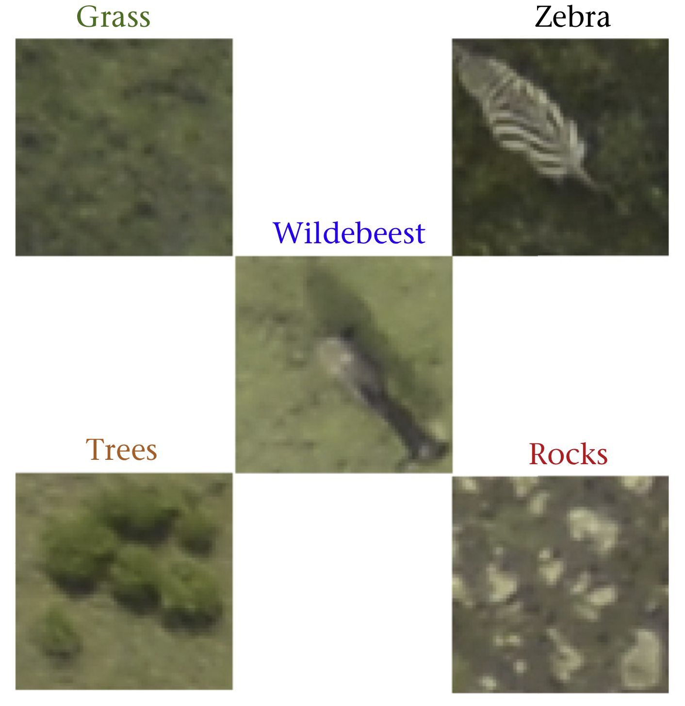
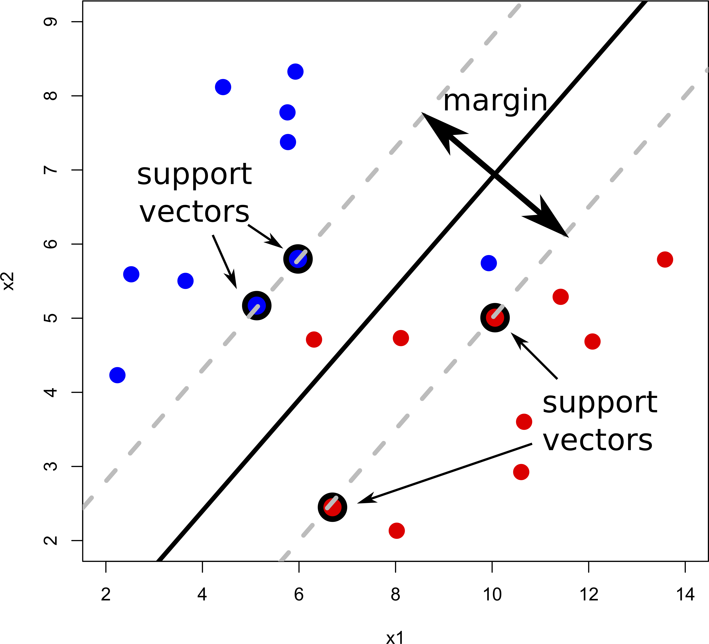

--- 
title: "Introduction to Machine Learning"
date: '26 March 2020'
author: "[Chris Yeomans](mailto:c.m.yeomans@exeter.ac.uk) and Jiangjiao Xu"
site: bookdown::bookdown_site
output:
    bookdown::gitbook:
        config:
            sharing: null
        css: '_style.css'
        includes:
            in_header: '_toggle.html'
        keep_md: TRUE
        highlight: pygments
    bookdown::pdf_book:
        keep_tex: yes
        includes:
            in_header: '_header.tex'
documentclass: book
link-citations: yes
description: "Introduction to Machine Learning"
---

# Preface {-}


*This course is based on original material by JJ Valetta from Easter 2019*

An introductory workshop on the field of machine learning. The focus will be on how to use these methods
in practice using R and Python, rather than on the rigorous underlying mathematics. The target audience
is anyone who wants to know what machine learning is, what problems it can solve and how we can solve them
in practice using R or Python.

## Prerequisites {-}

* Programming basics in either R or Python

## Learning outcomes {-}

* Understand the key concepts and terminology used in the field of machine learning
* Build predictive models for clustering, regression and classification problems
* Apply machine learning algorithms in R/Python to a variety of real-world datasets
* Recognise practical issues in data-driven modelling

## Recommended reading {-}

I highly recommend the following books:

* [An Introduction to Statistical Learning](http://www-bcf.usc.edu/~gareth/ISL/)
* [The Elements of Statistical Learning](https://web.stanford.edu/~hastie/ElemStatLearn/)
* [Pattern Recognition and Machine Learning](https://www.springer.com/gp/book/9780387310732)
* [Machine Learning: A Probabilistic Perspective](https://www.cs.ubc.ca/~murphyk/MLbook/)

## Software packages {-}

* R: [`caret`](http://topepo.github.io/caret/index.html)
* Python: [`scikit-learn`](https://scikit-learn.org/stable/)

**Please make sure to read the documentation of any machine learning algorithm *before* using it!**

## Data files {-}

All data files can be downloaded as a ZIP file from [here](https://exeter-data-analytics.github.io/MachineLearning/data.zip).

<!--chapter:end:index.Rmd-->

# Introduction


## Motivation

* Scientists are nowadays faced with an unprecedented amount of complex and big data sets 
(e.g. high-throughput sequencing, GIS (Geographical Information System) data, biomedical imaging and social media data).
* These data sets are very challenging to analyse due to nonlinear dependencies, mixed data sources and high-dimensionality.
* They often fail to conform to the assumptions of classical statistical methods.
* Hand-in-hand with the rise of computational power, machine learning (ML), has matured into a field of its own, 
to specificially extract knowledge from these challenging datasets.

## What is machine learning?

> A machine (an algorithm/model) improves its performance (predictive accuracy) in achieving a task (e.g 
classifying the content of an image) from experience (data).

> The automatic discovery of patterns and regularities in data. 

## What problems can machine learning solve?

* Object recognition

* Biomarker discovery in genomics

* Navigation of autonomous vehicles

* Fraud detection

* ... and much more!

## Types of machine learning methods

### Unsupervised learning {-}

Unsupervised learning methods uncover structure in unlabelled data. Structure means patterns in the data that are sufficiently different from pure unstructured noise. Structure can be discovered by:

* Determining the distribution of the data using **density estimation** techniques

    
* Visualising the data after **dimensionality reduction** (e.g Principal Component Analysis (PCA))

    
* Identifying groups of observations sharing similar attributes using **clustering** methods 


### Supervised learning {-}

Akin to traditional statistical models (e.g generalised linear models) supervised learning methods 
discover the relationship between an outcome and a set of explanatory variables. 
Using **training data**, the model learns the mapping (predictive model) between a set of features 
and a: 

* Continuous outcome - **regression**

    
* Categorical variable - **classification**


### Semi-supervised learning {-}

Similar to supervised learning, however these methods also make use of unlabelled data to improve
the model's predictive performance.

### Reinforcement learning {-}

These methods mimic the way humans learn new games or skills (e.g riding a unicycle). 
The machine/model explores different actions that maximise a **reward** (e.g score achieved in a game or
time spent upright on a unicyle) by a process of trial and error.
There is an inherent tradeoff between **exploration** (trying out new actions) and 
**exploitation** (use actions that already give reasonable results).
Here's a [nice example](http://mlg.eng.cam.ac.uk/wp/wp-content/uploads/2011/09/realunicycle.mp4).

In this introductory workshop we will only focus on unsupervised and supervised learning methods.

## Statistics and Machine Learning

There is substantial overlap between the fields of statistics and machine learning.
Some high-profile academics, such as [Robert Tibshirani](https://statweb.stanford.edu/~tibs/), even argue that ML is merely
"glorified statistics". He even provides a handy [glossary](http://statweb.stanford.edu/~tibs/stat315a/glossary.pdf).

We will not engage in a philosophical debate here, rather we focus 
on a pragmatic comparison between these two schools of thought,
which evolved from different research areas and tackled different problems.

|            | Statistics                                       | Machine learning                                 |
|------------|--------------------------------------------------|--------------------------------------------------|
| **Philosophy** | provide humans with a set of data analysis tools                | replace humans in the processing of data       |
| **Focus**      | what is the relationship between the data and the outcome? | how can we predict the outcome using the data? |
| **Inference**  | how was the observed data generated? what do the model parameters mean in practice?  | typically only care about predictions and not what the model parameters mean|
| **Learning**   | use all of the observed data to perform inference at the *population-level* | use training data, then use testing data to perfom *individual-level* predictions|
| **Validation** | measures of fit ($R^2$, chi-square test, etc.) and suitability of inferred parameters | predictive performance measures (root mean squared error (RMSE), area under the ROC cuve (AUC), etc.) computed on "unseen" data (generalisation)|
| **Model selection**  | adjusted measures of fit (adjusted $R^2$, $C_p$ statistic, Aikake information criterion, etc.) | Cross-validation and out-of-bag errors|

The line between ML and statistics is blurry at best. Personally, I do not find engaging in heated debates 
between the two fields to be healthy. Both fields complement each other and as the late Leo Breiman puts it:

> The best solution could be an algorithmic model (machine learning), or maybe a data model, 
or maybe a combination. But the trick to being a scientist is to be open to using a wide variety of tools.
>
> --- Leo Breiman

## Terminology

The jargon used in ML can be daunting at first. The table below summarises the most commonly encountered terms and their synonyms:

|                     |                                                  |
|---------------------|--------------------------------------------------|
| **Training dataset** | data used to train a set of machine learning models |
| **Validation dataset** | data used for model selection and validation i.e to choose a model which is complex enough to describe the data "well" but not more complex|
| **Testing dataset** | data *not* used when building the machine learning model, but used to evaluate the model's performance on previously unseen data (*generalisation* error) |
| **Features** | the covariates/predictors/inputs/attributes used to train the model |
| **Training error** | the model's performance evaluated on the training data (also known as in-sample or resubstitution error) |
| **Testing error** | the model's performance evaluated on the testing data (also known as out-of-sample or generalisation error) |

## A bird’s-eye view of building machine learning systems


**Health warning**: Real-life data is very messy. You *will* end up spending most of your time preparing your data 
into a format amenable for exploration/modelling. Do not despair, in this workshop you will be provided with clean data sets
that can be used straightaway. Nevertheless, if you have not attended a course on data wrangling
and visualisation yet, I would strongly recommend doing TJ McKinley's [course](https://exeter-data-analytics.github.io/AdVis/).

<!--chapter:end:01-intro.Rmd-->

# Clustering


## Motivation


The image above is from a microarray experiment ^[Nowadays microarrays have been largely replaced by sequencing technologies. However, the problem remains exactly the same]. The intensity
of each dot represents gene expression of a single gene (how "active" the gene is) for a particular individual/sample.
The resultant data is therefore a big matrix of numbers, where each column represents a gene and 
each row an individual/sample.

There are two questions of interest:

1. Which genes are co-regulated, that is, behave in the same way?
2. Which individuals are similar to each other, that is, have a similar gene expression profile?

In both cases we want to discover some underlying structure in *unlabelled* data. Structure means patterns
in the data that are sufficiently different from pure unstructured noise. Here we introduce clustering, 
a class of unsupervised learning methods that try to answer these questions.

## What is clustering?

> The goal of clustering is to find groups that share similar properties. 
The data in each group should be similar (minimise intracluster distance), but each 
cluster should be sufficiently different (maximise intercluster similarity).


## What problems can clustering solve?

Clustering is particularly useful in applications where labelling the data is very time consuming/expensive.

* **Gene expression**: discovering co-regulated genes.

* **Biological systematics**: finding organisms sharing similar attributes.

* **Computer vision**: segmenting a digital image for object recognition.

* **Epidemiology**: identifying geographical clusters of diseases.

* **Medical imaging**: differentiating between tissues.

* **Mathematical chemistry**: grouping compounds by topological indices.

* **Market basket analysis**: determining which group of items tend to be bought together.

* **Cybersecurity**: detecting fraudulent activity.

* ... and much more!

## Types of clustering methods

* **Partitional**: the feature space is partitioned into $k$ regions e.g $k$-means.

* **Hierarchical**: iteratively merging small clusters into larger ones (*agglomerative*) or breaking
large clusters into smaller ones (*divisive*).

* **Distribution-based**: fit $k$ multivariate statistical distributions e.g Gaussian mixture model (GMM).

## Similarity measures {#sec:similarity}

Most clustering methods rely on distance metrics that quantify how close two observations are. There
are several ways to define this distance, which has a direct effect on the clustering result.

The Euclidean distance (think Pythagoras theorem) is depicted below, together with the Manhatttan distance 
(named after the journey a taxi has to follow in grid-like streets of cities like Manhattan).


The correlation coefficient is also another popular way to measure similarity.


There are various other distance metrics, please see [`dist`](https://www.rdocumentation.org/packages/stats/versions/3.5.3/topics/dist) in R or [`pdist`](https://docs.scipy.org/doc/scipy/reference/generated/scipy.spatial.distance.pdist.html) in Python.
In this introductory workshop we will focus on continuous features, but be aware that distance measures
for categorical variables exists, such as, the [Jaccard index](https://en.wikipedia.org/wiki/Jaccard_index), 
[Gower distance](https://cran.r-project.org/web/packages/gower/index.html) and [polychoric correlation](https://en.wikipedia.org/wiki/Polychoric_correlation).

## The *Iris* dataset

To showcase some of the clustering methods, we will use the popular [*Iris* dataset](https://en.wikipedia.org/wiki/Iris_flower_data_set). The data set
consists of 50 samples from three species of *Iris* flower (*I. setosa*, *I. virginica* and *I. versicolor*).
Each flower is quantified by four measurements, length and width of sepal and petal.

Let us load this dataset:

<div class="tab"><button class="tablinksunnamed-chunk-14 active" onclick="javascript:openCode(event, 'option1unnamed-chunk-14', 'unnamed-chunk-14');">R</button><button class="tablinksunnamed-chunk-14" onclick="javascript:openCode(event, 'option2unnamed-chunk-14', 'unnamed-chunk-14');">Python</button></div><div id="option1unnamed-chunk-14" class="tabcontentunnamed-chunk-14">

```r
# The iris dataset is preloaded in R
head(iris)
```

```
  Sepal.Length Sepal.Width Petal.Length Petal.Width Species
1          5.1         3.5          1.4         0.2  setosa
2          4.9         3.0          1.4         0.2  setosa
3          4.7         3.2          1.3         0.2  setosa
4          4.6         3.1          1.5         0.2  setosa
5          5.0         3.6          1.4         0.2  setosa
6          5.4         3.9          1.7         0.4  setosa
```
</div><div id="option2unnamed-chunk-14" class="tabcontentunnamed-chunk-14">

```python
# The iris dataset is available from the sci-kit learn package
from sklearn import datasets
iris = datasets.load_iris()

# Print the first 6 rows
# Sepal Length, Sepal Width, Petal Length, Petal Width
iris.data[:6, ]
```

```
array([[5.1, 3.5, 1.4, 0.2],
       [4.9, 3. , 1.4, 0.2],
       [4.7, 3.2, 1.3, 0.2],
       [4.6, 3.1, 1.5, 0.2],
       [5. , 3.6, 1.4, 0.2],
       [5.4, 3.9, 1.7, 0.4]])
```
</div><script> javascript:hide('option2unnamed-chunk-14') </script>

## $k$-means

Arguably the most widely used partitioning clustering method. 
The feature space is divided into $k$ regions as follows:

1. Select $k$ centroids at random.

2. Compute the Euclidean distance between centroids and each data point.

3. Assign each data point to the closest centroid.

4. Compute new centroids; the average of all data points in that cluster.

5. Repeat steps 2 to 4 until data points remain in the same cluster or some maximum number of iterations reached.

**Note**: $k$-means clustering should **only** be used with continuous data!

For visualisation purposes let's just use two features of the *Iris* dataset; sepal length and petal width.

<div class="tab"><button class="tablinksunnamed-chunk-15 active" onclick="javascript:openCode(event, 'option1unnamed-chunk-15', 'unnamed-chunk-15');">R</button><button class="tablinksunnamed-chunk-15" onclick="javascript:openCode(event, 'option2unnamed-chunk-15', 'unnamed-chunk-15');">Python</button></div><div id="option1unnamed-chunk-15" class="tabcontentunnamed-chunk-15">

```r
# Fit k-means model
k <- 3
mdl <- kmeans(x=iris[, c(1, 4)], centers=k)

# Associate a colour with each cluster
library(RColorBrewer)
COL <- seq(k)
names(COL) <- brewer.pal(n=k, 'Set1')

# Plot results
plot(iris[, 4], iris[, 1], pch=19, col=names(COL[mdl$cluster]),
     xlab='Petal width (cm)', ylab='Sepal length (cm)')
```


</div><div id="option2unnamed-chunk-15" class="tabcontentunnamed-chunk-15">

```python
# Fit k-means model
from sklearn.cluster import KMeans
k = 3
mdl = KMeans(n_clusters=k, n_jobs=-1) # -1 uses all cores
mdl.fit(X=iris.data[:, [0, 3]])

# Associate a colour with each cluster
```

```python
from palettable.colorbrewer.qualitative import Set1_3
colDict = {0: Set1_3.hex_colors[0], 1: Set1_3.hex_colors[1], 2: Set1_3.hex_colors[2]}
myCol = [colDict[i] for i in mdl.labels_]

# Plot results
import matplotlib.pyplot as plt
plt.scatter(iris.data[:, 3], iris.data[:, 0], c=myCol)
plt.xlabel('Petal width (cm)')
plt.ylabel('Sepal length (cm)')
```


</div><script> javascript:hide('option2unnamed-chunk-15') </script>

|                     Pros             |             Cons                     |
|--------------------------------------|--------------------------------------|
| Simple and intuitive | $k$ needs to be specified *a priori* |
| Computationally inexpensive/fast | Only applicable for continuous data where a mean is defined|
|  | No guarantee of a global optimum solution |

## Agglomerative hiearchical clustering

In agglomerative hierarchical clustering small clusters are iteratively merged into larger ones. The clustering strategy is as follows:

1. Assign each datum as its own cluster.

2. Compute the distance between each cluster. 

3. Merge the closest pair into a single cluster. 

4. Repeat steps 2 to 3 until all clusters are merged together.

Step 3 is *key*, the distance metric and *linkage* function dictate the final result.
The *linkage* function specifies how the inter-cluster distance is computed. There are various options:

* **Centroid**: mean of data points (same as in $k$-means).


* **Single**: distance between closest pair of points.


* **Complete**: distance between furthest pair of points.


* **Average**: mean pairwise distance between all points.


The distance can be computed using any [similarity measure](#sec:similarity) introduced previously.

<div class="tab"><button class="tablinksunnamed-chunk-20 active" onclick="javascript:openCode(event, 'option1unnamed-chunk-20', 'unnamed-chunk-20');">R</button><button class="tablinksunnamed-chunk-20" onclick="javascript:openCode(event, 'option2unnamed-chunk-20', 'unnamed-chunk-20');">Python</button></div><div id="option1unnamed-chunk-20" class="tabcontentunnamed-chunk-20">

```r
# Compute distance matrix
d <- dist(x=iris[, c(1, 4)], method='euclidean') 

# Perform agglomerative hierarchical clustering
# Use 'average' link function
mdl <- hclust(d=d, method='average')

# Plot resultant dendrogram
plot(mdl, cex=0.6)
```


</div><div id="option2unnamed-chunk-20" class="tabcontentunnamed-chunk-20">

```python
from scipy.spatial.distance import pdist
from scipy.cluster.hierarchy import linkage, dendrogram

# Compute distance matrix
d = pdist(X=iris.data[:, [0, 3]], metric="euclidean")

# Perform agglomerative hierarchical clustering
# Use 'average' link function
mdl = linkage(d, method='average')

# Plot resultant dendrogram
plt.figure(figsize=(9,6))
dendrogram(mdl)
```

```python
plt.show()
```


</div><script> javascript:hide('option2unnamed-chunk-20') </script>

The number at the end of each branch corresponds to the observation row number.

|                     Pros             |             Cons                     |
|--------------------------------------|--------------------------------------|
| No need to specify $k$ | Can be computationally expensive |
| Sub-groups within larger clusters can be easily identified | Interpretation is subjective. Where should we draw the line?|
| Dendrograms let us visualise results irrespective of number of features | Choice of distance method and linkage function can significantly change the result |

## Gaussian mixture model (GMM)

The GMM is a simple but powerful model that performs clustering via density estimation. 
The features' histogram is modelled as the sum of multiple multivariate Gaussian distributions. 
Suppose we only had access to one feature, a GMM with $k=2$ would look something like this:


The blue dashed lines represent the two individual univariate Gaussians, whilst the black line 
depicts the combined model. We can extend this to more features by using multivariate Gaussians.
Mathematically this can be expressed as follows:

$$
p(x) = \sum_{i=1}^k \pi_i \mathcal{N}(x|\mu_i, \Sigma_i)\\
\sum_{i=1}^k \pi_i = 1
$$
The Expectation-Maximisation (EM) algorithm is used to estimate the parameters $\pi_i$ (known as mixing coefficients), 
$\mu_i$ and $\Sigma_i$. 

<div class="tab"><button class="tablinksunnamed-chunk-22 active" onclick="javascript:openCode(event, 'option1unnamed-chunk-22', 'unnamed-chunk-22');">R</button><button class="tablinksunnamed-chunk-22" onclick="javascript:openCode(event, 'option2unnamed-chunk-22', 'unnamed-chunk-22');">Python</button></div><div id="option1unnamed-chunk-22" class="tabcontentunnamed-chunk-22">

```r
library(mclust)
```

```
Package 'mclust' version 5.4.5
Type 'citation("mclust")' for citing this R package in publications.
```

```r
# Fit Gaussian Mixture Model
k <- 3 # no. of clusters
mdl <- Mclust(data=iris[, c(4, 1)], G=3)

# Plot results
plot(mdl, what='classification',
     xlab='Petal width (cm)', 
     ylab='Sepal length (cm)')
```


</div><div id="option2unnamed-chunk-22" class="tabcontentunnamed-chunk-22">

```python
import numpy as np
from matplotlib.colors import LogNorm
from sklearn.mixture import GaussianMixture as GMM

# Fit Gaussian Mixture Model
k = 3 # no. of clusters
mdl = GMM(n_components=3)
mdl.fit(X=iris.data[:, [3, 0]])

# Compute probability distribution function at each point on a gird
```

```python
x = np.linspace(np.min(iris.data[:, 3]), np.max(iris.data[:, 3]), 100)
y = np.linspace(np.min(iris.data[:, 0]), np.max(iris.data[:, 0]), 100)
X, Y = np.meshgrid(x, y)
XX = np.array([X.ravel(), Y.ravel()]).T
Z = -mdl.score_samples(XX)
Z = Z.reshape(X.shape)

# Plot results
hPlot = plt.contour(X, Y, Z, norm=LogNorm(), 
                 levels=np.logspace(0, 3, 10))
```

```python
plt.colorbar(hPlot, shrink=0.8, extend='both')
```

```python
plt.scatter(iris.data[:, 3], iris.data[:, 0])
plt.xlabel('Petal width (cm)')
plt.ylabel('Sepal length (cm)')
```


</div><script> javascript:hide('option2unnamed-chunk-22') </script>

|                     Pros             |             Cons                     |
|--------------------------------------|--------------------------------------|
| Intuitive interpretation | $k$ needs to be specified *a priori* |
| Computationally inexpensive | Strong assumption on the distribution of the feature space (multivariate Gaussian)|
|  | No guarantee of a global optimum solution |
|  | Fails when number of features is much greater than observations|

GMMs offer a "soft" clustering approach, where *every* observation is part of *every* cluster but
with varying levels of membership. 

## Determining the "correct" number of clusters

One of the biggest questions when it comes to clustering is "How many clusters do I have?".
The number of clusters $k$ cannot be determined *exactly*, because the observations are
unlabelled, so $k$ is inherently ambiguous. Moreover, similarity is quite subjective 
and often we cannot define a clear cut-off. 

For example, suppose that as part of a public health exercise we want to cluster 
a large group of individuals based on their health. Health is a multifaceted concept 
and cannot be observed directly; instead we measure various biomarkers, 
like body mass index (BMI), cholesterol levels, body composition,
resting metabolic rate, etc. Although we would be able to differentiate between
individuals at the two extremes (i.e athelete vs couch potato), most people
will sit somewhere on a continuum. There isn't a clear "line", that once crossed an individual
goes from being healthy to a bit unhealthy or moderately unhealthy etc. The number
of clusters is therefore somewhat dictated by the problem at hand and the type of questions
we're trying to answer. 

Nevertheless, there are various metrics that one can use to estimate the underlying number of clusters:

* Recall that the objective of clustering is to minimise the intracluster distance and 
maximise the intercluster similarity. Thus, we can plot the within and between clusters sum-of-squares distances
as a function of $k$. As we increase the number of clusters, there will be a point
where the sum-of-squares distances will only change marginally, that is, adding more 
clusters does not improve these metrics significantly. The number of clusters
is chosen to be the point at which the curve "plateaus" (5 in the synthetic example below). 
This is known as the "elbow criterion". Please refer to the [R](https://www.rdocumentation.org/packages/stats/versions/3.5.3/topics/kmeans) or
[Python](https://scikit-learn.org/stable/modules/generated/sklearn.cluster.KMeans.html) 
documentation on how to access these metrics.


* The silhouette width quantifies how similar an observation is to its own cluster
compared to other clusters. This measure ranges from -1 (not compatible with that cluster) to 1 (extremely likely to be part of that cluster).
The suggested configuration is the one that maximises the average silhouette width (3 in the synthetic example below).
Please refer to the [R](https://www.rdocumentation.org/packages/cluster/versions/2.0.7-1/topics/silhouette) or
[Python](https://scikit-learn.org/stable/auto_examples/cluster/plot_kmeans_silhouette_analysis.html#sphx-glr-auto-examples-cluster-plot-kmeans-silhouette-analysis-py) documentation on how to compute and plot these metrics.


* For distribution-based methods, choosing $k$ can be framed as a model selection problem.
We can plot the Akaike Information Criterion (AIC), Bayesian Information Criterior (BIC)
or other information criterion measures. 
As we increase the number of clusters, there will be a point
where the model fit will only improve marginally or start to decrease. The number of clusters
is chosen to be the point at which the curve "plateaus" 
(the "elbow criterion"; 5 in the synthetic example below). 
Please refer to the [R](https://www.rdocumentation.org/packages/mclust/versions/5.4.3/topics/Mclust) or
[Python](https://scikit-learn.org/stable/modules/generated/sklearn.mixture.GaussianMixture.html#sklearn.mixture.GaussianMixture) documentation on how to compute these metrics.


There are myriad other metrics available in the literature, some related to specific clustering algorithms. 
You will also encounter methods that claim to automatically discover the optimal number of clusters for you. 
Although, this can be true in a mathematical sense, this estimate will still be based on various underlying
assumptions and hyperparameters. 

These cluster validity measures only give us a **ballpark range**
for the "correct" number of clusters. 
Ultimately one needs to make use of prior knowledge to 
determine whether the number of clusters are **practically relevant** and if they **make sense**.
For example, how many different phenotypes are you expecting in your population?  

## Tasks

### Simulated data

Let's start to get a feel for these clustering algorithms by simulating some data:

<div class="tab"><button class="tablinksunnamed-chunk-26 active" onclick="javascript:openCode(event, 'option1unnamed-chunk-26', 'unnamed-chunk-26');">R</button><button class="tablinksunnamed-chunk-26" onclick="javascript:openCode(event, 'option2unnamed-chunk-26', 'unnamed-chunk-26');">Python</button></div><div id="option1unnamed-chunk-26" class="tabcontentunnamed-chunk-26">

```r
library(MASS) # mvrnorm (multivariate normal)

# Set simulation parameters
N <- 50 # no. of data points in each cluster
covMatrix <- matrix(data=c(1, 0, 0, 2), nrow=2)

# Simulate clusters (assume same covariances for now)
set.seed(1034) # to reproduce results
clustA <- mvrnorm(n=N, mu=c(6, 4), Sigma=covMatrix)
clustB <- mvrnorm(n=N, mu=c(3, 9), Sigma=covMatrix)
clustC <- mvrnorm(n=N, mu=c(9, 9), Sigma=covMatrix)

# Join all the data together and plot
xTrain <- rbind(clustA, clustB, clustC)
plot(xTrain[, 1], xTrain[, 2], pch=19,
xlab='Feature 1', ylab='Feature 2')
```


</div><div id="option2unnamed-chunk-26" class="tabcontentunnamed-chunk-26">

```python
from numpy.random import multivariate_normal, seed

# Set simulation parameters
N = 50 # no. of data points in each cluster
covMatrix = np.array([[1, 0], [0, 2]], dtype='float')

# Simulate clusters (assume same covariances for now)
seed(1034) # to reproduce results
clustA = multivariate_normal(mean=np.array([6, 4]), cov=covMatrix, size=N)
clustB = multivariate_normal(mean=np.array([3, 9]), cov=covMatrix, size=N)
clustC = multivariate_normal(mean=np.array([9, 9]), cov=covMatrix, size=N)

# Join all the data together and plot
xTrain = np.vstack((clustA, clustB, clustC))
plt.figure(figsize=(6,6))
plt.scatter(xTrain[:, 0], xTrain[:, 1])
plt.xlabel('Feature 1')
plt.ylabel('Feature 2')
```


</div><script> javascript:hide('option2unnamed-chunk-26') </script>

<div class="panel panel-default"><div class="panel-heading"> Task </div><div class="panel-body"> 
* Perform $k$-means clustering by allowing $k$ to vary from 2 to 6 . 

* Plot the intra and intercluster sum-of-squares as a function of $k$ and deduce the
"true" number of underlying clusters. </div></div>

<button id="displayTextunnamed-chunk-28" onclick="javascript:toggle('unnamed-chunk-28');">Show Solution</button>

<div id="toggleTextunnamed-chunk-28" style="display: none"><div class="panel panel-default"><div class="panel-heading panel-heading1"> Solution </div><div class="panel-body"><div class="tab"><button class="tablinksunnamed-chunk-28 active" onclick="javascript:openCode(event, 'option1unnamed-chunk-28', 'unnamed-chunk-28');">R</button><button class="tablinksunnamed-chunk-28" onclick="javascript:openCode(event, 'option2unnamed-chunk-28', 'unnamed-chunk-28');">Python</button></div><div id="option1unnamed-chunk-28" class="tabcontentunnamed-chunk-28">

```r
# Initialise some variables
kRange <- seq(from=2, to=6, by=1)
intra <- rep(NA, length(kRange)) # intracluster sum-of-squares
inter <- rep(NA, length(kRange)) # intercluster sum-of-squares

# Loop across desired range of ks
for (k in kRange) {
    mdl <- kmeans(x=xTrain , centers=k)
    intra[k-1] <- mdl$tot.withinss # it’s (k-1) because k starts from 2
    inter[k-1] <- mdl$betweenss 
}

# Plot inter/intercluster sum-of-squares as a function of $k$
yMin <- min(c(intra , inter)) 
yMax <- max(c(intra , inter))
plot(kRange, inter, type="o", pch=1, col="blue", lwd=3, lty=1, 
ylim=c(yMin, yMax), xlab="k", ylab='Sum-of-squares')
points(kRange, intra, type="o", pch=1, col="red", lwd=3)
legend("right", c("inter-cluster", "intra-cluster"), 
bty="n", col=c("blue", "red"), pch=1, lwd=3, lty=1)
```


The "correct" number of clusters is approximately 3.
This matches our expectation.
</div><div id="option2unnamed-chunk-28" class="tabcontentunnamed-chunk-28">

```python
from sklearn.preprocessing import scale

# Initialise some variables
kRange = range(2, 7)
intra = np.empty(len(kRange)) # intracluster sum-of-squares
inter = np.empty(len(kRange)) # intercluster sum-of-squares

# Loop across desired range of ks
for k in kRange:
    mdl = KMeans(n_clusters=k)
    mdl.fit(X=xTrain)
    intra[k-2] = mdl.inertia_  # it’s (k-2) because k starts from 2
    inter[k-2] = np.sum(scale(xTrain, with_std=False)**2) - mdl.inertia_

# Plot inter/intercluster sum-of-squares as a function of $k$
```

```python
plt.figure(figsize=(5,5))
plt.plot(kRange, inter, 'bo-', label='inter-cluster')
plt.plot(kRange, intra, 'ro-', label='intra-cluster')
plt.legend(loc='center right')
plt.xlabel('k')
plt.ylabel('Sum-of-squares')
```


The "correct" number of clusters is approximately 3.
This matches our expectation.
</div><script> javascript:hide('option2unnamed-chunk-28') </script></div></div></div>


<div class="panel panel-default"><div class="panel-heading"> Task </div><div class="panel-body"> 
* Fit a Gaussian Mixture Model (GMM) by allowing $k$ to vary from 2 to 6 . 

* Plot the AIC and BIC as a function of $k$ and deduce the "true" number of underlying clusters. </div></div>

<button id="displayTextunnamed-chunk-30" onclick="javascript:toggle('unnamed-chunk-30');">Show Solution</button>

<div id="toggleTextunnamed-chunk-30" style="display: none"><div class="panel panel-default"><div class="panel-heading panel-heading1"> Solution </div><div class="panel-body"><div class="tab"><button class="tablinksunnamed-chunk-30 active" onclick="javascript:openCode(event, 'option1unnamed-chunk-30', 'unnamed-chunk-30');">R</button><button class="tablinksunnamed-chunk-30" onclick="javascript:openCode(event, 'option2unnamed-chunk-30', 'unnamed-chunk-30');">Python</button></div><div id="option1unnamed-chunk-30" class="tabcontentunnamed-chunk-30">

```r
# Initialise some variables
kRange <- seq(from=2, to=6, by=1)
AIC <- rep(NA, length(kRange)) # Akaike information criterion
BIC <- rep(NA, length(kRange)) # Bayesian information criterion


# Loop across desired range of ks
for (k in kRange) {
    mdl <- Mclust(data=xTrain, G=k)
    AIC[k-1] <- 2*mdl$loglik - 2*mdl$df
    BIC[k-1] <- mdl$bic
}

# Plot inter/intercluster sum-of-squares as a function of $k$
yMin <- min(c(AIC , BIC)) 
yMax <- max(c(AIC , BIC))
plot(kRange, AIC, type="o", pch=1, col="blue", lwd=3, lty=1, 
ylim=c(yMin, yMax), xlab="k", ylab='Information criterion')
points(kRange, BIC, type="o", pch=1, col="red", lwd=3)
legend("right", c("AIC", "BIC"), 
bty="n", col=c("blue", "red"), pch=1, lwd=3, lty=1)
```


The "correct" number of clusters is approximately 3.
This matches our expectation.
</div><div id="option2unnamed-chunk-30" class="tabcontentunnamed-chunk-30">

```python
# Initialise some variables
kRange = range(2, 7)
AIC = np.empty(len(kRange)) # Akaike information criterion
BIC = np.empty(len(kRange)) # Bayesian information criterion

# Loop across desired range of ks
for k in kRange:
    mdl = GMM(n_components=k)
    mdl.fit(X=xTrain)
    AIC[k-2] = -mdl.aic(xTrain)
    BIC[k-2] = -mdl.bic(xTrain)

# Plot inter/intercluster sum-of-squares as a function of $k$
```

```python
plt.figure(figsize=(6,6))
plt.plot(kRange, AIC, 'bo-', label='AIC')
plt.plot(kRange, BIC, 'ro-', label='BIC')
plt.legend(loc='center right')
plt.xlabel('k')
plt.ylabel('Information criterion')
```


The "correct" number of clusters is approximately 3.
This matches our expectation.
</div><script> javascript:hide('option2unnamed-chunk-30') </script></div></div></div>

<div class="panel panel-default"><div class="panel-heading"> Task </div><div class="panel-body"> 
Perform the above analysis on several sets of simulated data by changing the mean
and covariance matrix of each simulated cluster. Try bringing the clusters closer 
together and then push them further apart. What happens to intra/intercluster distance
and AIC/BIC plots? </div></div>

<button id="displayTextunnamed-chunk-32" onclick="javascript:toggle('unnamed-chunk-32');">Show Solution</button>

<div id="toggleTextunnamed-chunk-32" style="display: none"><div class="panel panel-default"><div class="panel-heading panel-heading1"> Solution </div><div class="panel-body">
* As clusters move closer together, the "elbow" becomes less
pronounced due to the large overlap between clusters. The
"correct" number of clusters will inevitably become more ambiguous.

* As clusters move further apart, the "elbow" becomes more
pronounced, making it easier to determine the "correct" number of clusters. 
Note, however, that we could still have sub-groups within a particular cluster;
it's just that the within-cluster dissimilarity would be subtle compared to the across-clusters
dissimilarity. For example, if one were to cluster a large set
of images containing dogs, cats and horses, you would expect to find three distinct
clusters. However, we know that within the dogs cluster you'd also have sub-clusters
related to different species of dogs. </div></div></div>

### Gene expression

The file `gene_expression.csv` (all workshop datasets are available [here](https://exeter-data-analytics.github.io/MachineLearning/data.zip)),
contains the acute lymphoblastic leukaemia (ALL) dataset which was published in the following study 
(see [here](http://www.bloodjournal.org/content/103/7/2771) and [here](http://clincancerres.aacrjournals.org/content/11/20/7209)).
The dataset contains *normalised* gene expression values (measured using microarray) for 128 patients
and 12,625 genes. The patients were diagnosed with either a B- or T-cell acute lymphocytic leukaemia. 

Do not worry too much about the details (i.e what the genes are etc.), 
treat this dataset as a $G \times N$ matrix where $G$ is the total number of genes 
and $N$ is the number of patients.
We have access to the labels, type and stage of the disease (e.g B2). Thus, we can easily 
assess how well the clustering algorithm is doing, as we expect the B’s and T’s to cluster together. 

<div class="tab"><button class="tablinksunnamed-chunk-33 active" onclick="javascript:openCode(event, 'option1unnamed-chunk-33', 'unnamed-chunk-33');">R</button><button class="tablinksunnamed-chunk-33" onclick="javascript:openCode(event, 'option2unnamed-chunk-33', 'unnamed-chunk-33');">Python</button></div><div id="option1unnamed-chunk-33" class="tabcontentunnamed-chunk-33">

```r
xTrain <- read.csv('_data/gene_expression.csv', row.names=1)
print(dim(xTrain))
```

```
[1] 12625   128
```
</div><div id="option2unnamed-chunk-33" class="tabcontentunnamed-chunk-33">

```python
import pandas as pd

xTrain = pd.read_csv('_data/gene_expression.csv', header=0, index_col=0)
print(xTrain.shape)
```

```
(12625, 128)
```
</div><script> javascript:hide('option2unnamed-chunk-33') </script>

<div class="panel panel-default"><div class="panel-heading"> Task </div><div class="panel-body"> 
Perform agglomerative hierarchical clustering on the 128 patients. Keep the distance
method as `euclidean`, but change the linkage method (e.g single, average) and
observe how the dendrogram changes. </div></div>

<button id="displayTextunnamed-chunk-35" onclick="javascript:toggle('unnamed-chunk-35');">Show Solution</button>

<div id="toggleTextunnamed-chunk-35" style="display: none"><div class="panel panel-default"><div class="panel-heading panel-heading1"> Solution </div><div class="panel-body"><div class="tab"><button class="tablinksunnamed-chunk-35 active" onclick="javascript:openCode(event, 'option1unnamed-chunk-35', 'unnamed-chunk-35');">R</button><button class="tablinksunnamed-chunk-35" onclick="javascript:openCode(event, 'option2unnamed-chunk-35', 'unnamed-chunk-35');">Python</button></div><div id="option1unnamed-chunk-35" class="tabcontentunnamed-chunk-35">

```r
linkMethods <- c('single', 'complete', 'average')
distMethod <- 'euclidean'
distance <- dist(as.matrix(t(xTrain), method=distMethod))
for (linkMethod in linkMethods) {
    mdl <- hclust(distance , method=linkMethod)
    plot(mdl, cex=0.5, xlab='distance', 
    main=paste0(distMethod, ' distance and ', linkMethod, ' link function'))
}
```


</div><div id="option2unnamed-chunk-35" class="tabcontentunnamed-chunk-35">

```python
linkMethods = ['single', 'complete', 'average']
distMethod = 'euclidean'
distance = pdist(X=xTrain.T, metric=distMethod )
for linkMethod in linkMethods:
    mdl = linkage(distance, method=linkMethod)
    plt.figure(num=linkMethod, figsize=(9,6))
    dendrogram(mdl)
    plt.title('{0} distance and {1} link function'.format(distMethod, linkMethod))
    plt.show()
```


</div><script> javascript:hide('option2unnamed-chunk-35') </script></div></div></div>

<div class="panel panel-default"><div class="panel-heading"> Task </div><div class="panel-body"> 
Same as before, but now keep the linkage method as `average` and change
the distance method (e.g euclidean, manhattan) and observe how the dendrogram changes. </div></div>

<button id="displayTextunnamed-chunk-37" onclick="javascript:toggle('unnamed-chunk-37');">Show Solution</button>

<div id="toggleTextunnamed-chunk-37" style="display: none"><div class="panel panel-default"><div class="panel-heading panel-heading1"> Solution </div><div class="panel-body"><div class="tab"><button class="tablinksunnamed-chunk-37 active" onclick="javascript:openCode(event, 'option1unnamed-chunk-37', 'unnamed-chunk-37');">R</button><button class="tablinksunnamed-chunk-37" onclick="javascript:openCode(event, 'option2unnamed-chunk-37', 'unnamed-chunk-37');">Python</button></div><div id="option1unnamed-chunk-37" class="tabcontentunnamed-chunk-37">

```r
linkMethod <- 'average'
distMethods <- c('euclidean', 'manhattan', 'canberra')
for (distMethod in distMethods) {
    distance <- dist(as.matrix(t(xTrain), method=distMethod))
    mdl <- hclust(distance , method=linkMethod)
    plot(mdl, cex=0.5, xlab='distance', 
    main=paste0(distMethod, ' distance and ', linkMethod, ' link function'))
}
```


</div><div id="option2unnamed-chunk-37" class="tabcontentunnamed-chunk-37">

```python
linkMethod = 'average'
distMethods = ['euclidean', 'cityblock', 'canberra']
for distMethod in distMethods:
    distance = pdist(X=xTrain.T, metric=distMethod )
    mdl = linkage(distance, method=linkMethod)
    plt.figure(num=distMethod, figsize=(9,6))
    dendrogram(mdl)
    plt.title('{0} distance and {1} link function'.format(distMethod, linkMethod))
    plt.show()
```


</div><script> javascript:hide('option2unnamed-chunk-37') </script></div></div></div>

### Wine

The file `wine.csv` contains chemical analysis data of wines grown in the *same* region 
in Italy but from three different cultivars (see [here](https://archive.ics.uci.edu/ml/datasets/Wine) for details).


<div class="tab"><button class="tablinksunnamed-chunk-38 active" onclick="javascript:openCode(event, 'option1unnamed-chunk-38', 'unnamed-chunk-38');">R</button><button class="tablinksunnamed-chunk-38" onclick="javascript:openCode(event, 'option2unnamed-chunk-38', 'unnamed-chunk-38');">Python</button></div><div id="option1unnamed-chunk-38" class="tabcontentunnamed-chunk-38">

```r
xTrain <- read.csv('_data/wine.csv')
print(head(xTrain))
```

```
  WineType Alcohol MalicAcid  Ash AlcalinityAsh Magnesium TotalPhenols
1        A   14.23      1.71 2.43          15.6       127         2.80
2        A   13.20      1.78 2.14          11.2       100         2.65
3        A   13.16      2.36 2.67          18.6       101         2.80
4        A   14.37      1.95 2.50          16.8       113         3.85
5        A   13.24      2.59 2.87          21.0       118         2.80
6        A   14.20      1.76 2.45          15.2       112         3.27
  Flavanoids NonflavanoidPhenols Proanthocyanins ColorIntensity  Hue
1       3.06                0.28            2.29           5.64 1.04
2       2.76                0.26            1.28           4.38 1.05
3       3.24                0.30            2.81           5.68 1.03
4       3.49                0.24            2.18           7.80 0.86
5       2.69                0.39            1.82           4.32 1.04
6       3.39                0.34            1.97           6.75 1.05
  OD280_OD315 Proline
1        3.92    1065
2        3.40    1050
3        3.17    1185
4        3.45    1480
5        2.93     735
6        2.85    1450
```
</div><div id="option2unnamed-chunk-38" class="tabcontentunnamed-chunk-38">

```python
xTrain = pd.read_csv('_data/wine.csv', header=0)
print(xTrain.head())
```

```
  WineType  Alcohol  MalicAcid  ...   Hue  OD280_OD315  Proline
0        A    14.23       1.71  ...  1.04         3.92     1065
1        A    13.20       1.78  ...  1.05         3.40     1050
2        A    13.16       2.36  ...  1.03         3.17     1185
3        A    14.37       1.95  ...  0.86         3.45     1480
4        A    13.24       2.59  ...  1.04         2.93      735

[5 rows x 14 columns]
```
</div><script> javascript:hide('option2unnamed-chunk-38') </script>

There are thirteen variables (`Alcohol`, `MalicAcid`, etc.), together with `WineType`, which specifies the type of wine.
Here, we are going to pretend we do not know that there are three types of wine, instead we'll use
clustering methods to uncover this information.

One thing to notice with this data, is that the units vary greatly across variables. For example, `Proline` ranges
from 278 to 1680, whilst `MalicAcid` ranges from 0.74 to 
5.8. So first we need to normalise the data, so that they're on a common scale. 

<div class="tab"><button class="tablinksunnamed-chunk-39 active" onclick="javascript:openCode(event, 'option1unnamed-chunk-39', 'unnamed-chunk-39');">R</button><button class="tablinksunnamed-chunk-39" onclick="javascript:openCode(event, 'option2unnamed-chunk-39', 'unnamed-chunk-39');">Python</button></div><div id="option1unnamed-chunk-39" class="tabcontentunnamed-chunk-39">

```r
wineType <- xTrain$WineType # save for comparison
xTrain <- scale(xTrain[-1], center=TRUE, scale=TRUE)
print(head(xTrain))
```

```
       Alcohol   MalicAcid        Ash AlcalinityAsh  Magnesium TotalPhenols
[1,] 1.5143408 -0.56066822  0.2313998    -1.1663032 1.90852151    0.8067217
[2,] 0.2455968 -0.49800856 -0.8256672    -2.4838405 0.01809398    0.5670481
[3,] 0.1963252  0.02117152  1.1062139    -0.2679823 0.08810981    0.8067217
[4,] 1.6867914 -0.34583508  0.4865539    -0.8069748 0.92829983    2.4844372
[5,] 0.2948684  0.22705328  1.8352256     0.4506745 1.27837900    0.8067217
[6,] 1.4773871 -0.51591132  0.3043010    -1.2860793 0.85828399    1.5576991
     Flavanoids NonflavanoidPhenols Proanthocyanins ColorIntensity        Hue
[1,]  1.0319081          -0.6577078       1.2214385      0.2510088  0.3611585
[2,]  0.7315653          -0.8184106      -0.5431887     -0.2924962  0.4049085
[3,]  1.2121137          -0.4970050       2.1299594      0.2682629  0.3174085
[4,]  1.4623994          -0.9791134       1.0292513      1.1827317 -0.4263410
[5,]  0.6614853           0.2261576       0.4002753     -0.3183774  0.3611585
[6,]  1.3622851          -0.1755994       0.6623487      0.7298108  0.4049085
     OD280_OD315     Proline
[1,]   1.8427215  1.01015939
[2,]   1.1103172  0.96252635
[3,]   0.7863692  1.39122370
[4,]   1.1807407  2.32800680
[5,]   0.4483365 -0.03776747
[6,]   0.3356589  2.23274072
```
</div><div id="option2unnamed-chunk-39" class="tabcontentunnamed-chunk-39">

```python
from sklearn.preprocessing import scale
wineType = xTrain['WineType'] # save for comparison
xTrain = scale(xTrain.drop(labels='WineType', axis=1), 
               with_mean=True, with_std=True)
print(xTrain)
```

```
[[ 1.51861254 -0.5622498   0.23205254 ...  0.36217728  1.84791957
   1.01300893]
 [ 0.24628963 -0.49941338 -0.82799632 ...  0.40605066  1.1134493
   0.96524152]
 [ 0.19687903  0.02123125  1.10933436 ...  0.31830389  0.78858745
   1.39514818]
 ...
 [ 0.33275817  1.74474449 -0.38935541 ... -1.61212515 -1.48544548
   0.28057537]
 [ 0.20923168  0.22769377  0.01273209 ... -1.56825176 -1.40069891
   0.29649784]
 [ 1.39508604  1.58316512  1.36520822 ... -1.52437837 -1.42894777
  -0.59516041]]
```
</div><script> javascript:hide('option2unnamed-chunk-39') </script>

<div class="panel panel-default"><div class="panel-heading"> Task </div><div class="panel-body"> 
* Perform $k$-means clustering by allowing $k$ to vary from 1 to 10 . 

* Plot the intra and intercluster sum-of-squares as a function of $k$ 
    and deduce the "true" number of underlying clusters. </div></div>

<button id="displayTextunnamed-chunk-41" onclick="javascript:toggle('unnamed-chunk-41');">Show Solution</button>

<div id="toggleTextunnamed-chunk-41" style="display: none"><div class="panel panel-default"><div class="panel-heading panel-heading1"> Solution </div><div class="panel-body"><div class="tab"><button class="tablinksunnamed-chunk-41 active" onclick="javascript:openCode(event, 'option1unnamed-chunk-41', 'unnamed-chunk-41');">R</button><button class="tablinksunnamed-chunk-41" onclick="javascript:openCode(event, 'option2unnamed-chunk-41', 'unnamed-chunk-41');">Python</button></div><div id="option1unnamed-chunk-41" class="tabcontentunnamed-chunk-41">

```r
# Initialise some variables
kRange <- seq(from=1, to=10, by=1)
intra <- rep(NA, length(kRange)) # intracluster sum-of-squares
inter <- rep(NA, length(kRange)) # intercluster sum-of-squares

# Loop across desired range of ks
for (k in kRange) {
    mdl <- kmeans(x=xTrain , centers=k)
    intra[k] <- mdl$tot.withinss
    inter[k] <- mdl$betweenss 
}

# Plot inter/intercluster sum-of-squares as a function of $k$
yMin <- min(c(intra , inter)) 
yMax <- max(c(intra , inter))
plot(kRange, inter, type="o", pch=1, col="blue", lwd=3, lty=1, 
     ylim=c(yMin, yMax), xlab="k", ylab='Sum-of-squares')
points(kRange, intra, type="o", pch=1, col="red", lwd=3)
legend("topright", c("inter-cluster", "intra-cluster"), 
       bty="n", col=c("blue", "red"), pch=1, lwd=3, lty=1)
```


The "correct" number of clusters is approximately 3.
This matches our expectation.
</div><div id="option2unnamed-chunk-41" class="tabcontentunnamed-chunk-41">

```python
from sklearn.preprocessing import scale

# Initialise some variables
kRange = range(1, 11)
intra = np.empty(len(kRange)) # intracluster sum-of-squares
inter = np.empty(len(kRange)) # intercluster sum-of-squares

# Loop across desired range of ks
for k in kRange:
    mdl = KMeans(n_clusters=k)
    mdl.fit(X=xTrain)
    intra[k-1] = mdl.inertia_ 
    inter[k-1] = np.sum(scale(xTrain, with_std=False)**2) - mdl.inertia_

# Plot inter/intercluster sum-of-squares as a function of $k$
```

```python
plt.figure(figsize=(5,5))
plt.plot(kRange, inter, 'bo-', label='inter-cluster')
plt.plot(kRange, intra, 'ro-', label='intra-cluster')
plt.legend(loc='upper right')
plt.xlabel('k')
plt.ylabel('Sum-of-squares')
```


The "correct" number of clusters is approximately 3.
This matches our expectation.
</div><script> javascript:hide('option2unnamed-chunk-41') </script></div></div></div>

<div class="panel panel-default"><div class="panel-heading"> Task </div><div class="panel-body"> 
* Perform silhouette analysis on the clusters obtained with $k$-means for $k$ = 2 to 5.

* What's the suggested number of clusters? </div></div>

<button id="displayTextunnamed-chunk-43" onclick="javascript:toggle('unnamed-chunk-43');">Show Solution</button>

<div id="toggleTextunnamed-chunk-43" style="display: none"><div class="panel panel-default"><div class="panel-heading panel-heading1"> Solution </div><div class="panel-body"><div class="tab"><button class="tablinksunnamed-chunk-43 active" onclick="javascript:openCode(event, 'option1unnamed-chunk-43', 'unnamed-chunk-43');">R</button><button class="tablinksunnamed-chunk-43" onclick="javascript:openCode(event, 'option2unnamed-chunk-43', 'unnamed-chunk-43');">Python</button></div><div id="option1unnamed-chunk-43" class="tabcontentunnamed-chunk-43">

```r
library(cluster) # for silhouette function

# Initialise some variables
kRange <- seq(from=2, to=5, by=1)
avgWidth <- rep(NA, length(kRange))

# Loop across desired range of ks
for (k in kRange) {
    mdl <- kmeans(x=xTrain , centers=k)
    silh <- silhouette(mdl$cluster, dist(xTrain))
    plot(silh, main=paste0('k=', k))
    avgWidth[k-1] <- mean(silh[, 3])
}
```


```r
# Plot average width as a function of k 
plot(kRange, avgWidth, type="o", pch=1, col="blue", lwd=3, 
     lty=1, xlab="k", ylab="Average silhouette width")
```


The "correct" number of clusters is approximately 3.
This matches our expectation. However, note that the average
silhouette width is quite low, suggesting that some wines
are ambiguously assigned to a cluster, and that in general the clusters are not
very homogenous.
</div><div id="option2unnamed-chunk-43" class="tabcontentunnamed-chunk-43">

```python
# Unfortunately in scikit-learn there is not a readily available function
# to plot silhouettes, so we will have to write one ourselves
# Adapted from scikit-learn:
from sklearn.metrics import silhouette_samples, silhouette_score
import numpy as np

#===================================================================#
def plot_silhouette(mdl, xTrain):
    """
    Plots a silhouette plot for a k-means object mdl
    It also requires the training data xTrain
    """
    # Compute the silhouette scores for all samples
    clustLabels = mdl.labels_
    silhScores = silhouette_samples(xTrain, clustLabels)
    
    # Loop across all clusters
    hFig = plt.figure(figsize=(6,6))
    yMin = 10
    for i in range(mdl.n_clusters):
        # Aggregate scores for that cluster and sort them
        thisSilhScores = silhScores[clustLabels == i]
        thisSilhScores.sort()
        
        # Set plot limits and plot
        yMax = yMin + len(thisSilhScores)
        plt.fill_betweenx(np.arange(yMin, yMax), 0, thisSilhScores, 
                          facecolor='grey', edgecolor='black', alpha=0.7)
        plt.xlabel('Silhouette width $s_i$')
        plt.title('k={}, n={}\n Average silhouette width: {:.2f}'\
                  .format(mdl.n_clusters, xTrain.shape[0], np.mean(silhScores)))

        # Leave space before plotting next cluster
        yMin = yMax + 10
    
    # Show plot
    plt.show()
    
    return hFig
    
#===================================================================#
    
# Initialise some variables
kRange = range(2, 6)
avgWidth = np.empty(len(kRange))

# Loop across desired range of ks
for k in kRange:
    mdl = KMeans(n_clusters=k).fit(X=xTrain)
    avgWidth[k-2] = silhouette_score(xTrain, mdl.labels_)
    plot_silhouette(mdl, xTrain)

# Plot average width as a function of k
```


```python
plt.figure(figsize=(5,5))
plt.plot(kRange, avgWidth, 'bo-')
plt.xlabel('k')
plt.ylabel('Average silhouette width')
```


The "correct" number of clusters is approximately 3.
This matches our expectation. However, note that the average
silhouette width is quite low, suggesting that some wines
are ambiguously assigned to a cluster, and that in general the clusters are not
very homogenous.
</div><script> javascript:hide('option2unnamed-chunk-43') </script></div></div></div>

<!--chapter:end:02-clustering.Rmd-->

# Dimensionality Reduction  


High-dimensional datasets are nowadays very common in science.
Reducing the number of features per observation can provide several benefits:

* Elucidating the best predictors of the underlying process (plausible causal drivers under an experimental setup).

* Highlighting the data's structure through visualisation.

* Improving the model's predictive performance by removing uninformative features/extracting better features.

* Decreasing computational power.

The rationale behind dimensionality reduction is straightforward:

> Although the data may seem high dimensional, the **structure** of the data can be represented by fewer features.

This situation arises due to redundant features; driven by multicollinearity and/or covariates that
are only weakly associated with the underlying process. 
Reducing the dimensionality of a problem is achieved through:

* **Feature extraction**: mapping the original data to a new feature set.

* **Feature selection**: selecting a subset of attributes.

In the machine learning literature the term dimensionality reduction is commonly associated with
(typically) unsupervised methods that transform high-dimensional data to a lower dimensional feature set, 
whilst feature selection is treated as part of the predictive modelling framework. This is because
feature selection is generally performed in a supervised fashion (although some unsupervised methods
do exist). Following this notion, feature selection will be discussed later on in the supervised learning section.

## Feature extraction

Analogous to representing complex and multifaceted concepts, such as biological diversity or health by using a diversity index or 
body mass index (BMI), feature extraction deals with finding "good" representations of high-dimensional data sets. 
For example, should we describe an image by individual pixel intensities or by extracting higher-order structures such as edges and
shapes? The objective is to:

> Construct new features from the original measured variables that accentuate the inherent patterns in the data and are non-redundant. 

Feature extraction is a key step in machine learning; finding representations that are directly relevant to the task at hand (e.g. discriminating between two classes) will almost always result in better predictive accuracy than employing more complex models.
Dimensionality reduction techniques aggregate dimensions together while trying to preserve as much of the data's structure as possible. 
That is, observations that are "close" to each other remain so in the lower-dimensional projection.

Here we introduce two popular "automatic" methods, PCA and t-SNE. Note, that the alternative to "automatic" methods 
is to "hand-craft" features, also known as feature engineering. 
This relies on expert knowledge to specify a set of potentially discriminatory features.
For example, activity trackers (e.g Fitbit, Garmin Vivosport) rely on accelerometer data (the "raw" observed data)
to recognise the current activity (e.g sleeping, running, walking). This rather noisy accelerometer data
cannot be used directly. Instead a sliding time window is used to compute
several time-domain (e.g statistical attributes such as mean and variance) and 
frequency-domain (e.g min/max frequencies, band power) features.

### PCA

Principal component analysis (PCA) is a **linear** dimensionality reduction method with widespread use. 
The new uncorrelated features (PCA 1, PCA 2,...) are **weighted** linear combinations of the original data: 

$$
\text{PCA 1} = w_{11}x_1 + w_{12}x_2 + \ldots + w_{1p}x_p\\
\text{PCA 2} = w_{21}x_1 + w_{22}x_2 + \ldots + w_{2p}x_p\\
\vdots\\ 
\text{PCA p} = w_{p1}x_1 + w_{p2}x_2 + \ldots + w_{pp}x_p
$$
Where the $x$'s are the original features and $w$'s are the weights

The weights are determined in such a way to find directions, called principal components,
that maximise the variance of the data. Mathematically, this is the same as minimising
the sum of squared distances from data points to their projections. This is also equivalent
to maximising the trace and determinant of the covariance matrix of the projected data.


For a data matrix $X \in \mathbb{R}^{n\ \mathrm{x}\ p}$, ($n$: no. observations, $p$: no. of covariates), 
the PCAs can be derived as follows:

1. Compute covariance matrix $\Sigma$ on the standardised data.

2. Compute eigenvectors/eigenvalues of covariance matrix $\Sigma = U\Lambda U^{-1}$. 
Where$\Lambda$ is a diagonal matrix of eigenvalues
and the columns in $U$ are the eigenvectors. ^[$\Sigma$ must be postive semi-definite. The singular value decomposition (SVD) is usually preferred over eigendecomposition as it's more numerically stable]

3. Sort eigenvectors by decreasing eigenvalues and choose $k$ eigenvectors with the largest eigenvalues.

4. Use resultant $p \times k$ matrix to project $X$ onto new subspace.

5. The variance explained by the chosen $k$-components is $\frac{\sum_{i=1}^k\lambda_i}{\sum_{i=1}^D\lambda_i} \times 100\%$

Typically the first two or three components are used to plot the data in an attempt to reveal any groupings.

<div class="tab"><button class="tablinksunnamed-chunk-46 active" onclick="javascript:openCode(event, 'option1unnamed-chunk-46', 'unnamed-chunk-46');">R</button><button class="tablinksunnamed-chunk-46" onclick="javascript:openCode(event, 'option2unnamed-chunk-46', 'unnamed-chunk-46');">Python</button></div><div id="option1unnamed-chunk-46" class="tabcontentunnamed-chunk-46">

```r
# Perform PCA and show summary
mdl <- prcomp(x=iris[-5]) 
summary(mdl)
```

```
Importance of components:
                          PC1     PC2    PC3     PC4
Standard deviation     2.0563 0.49262 0.2797 0.15439
Proportion of Variance 0.9246 0.05307 0.0171 0.00521
Cumulative Proportion  0.9246 0.97769 0.9948 1.00000
```

```r
# Extract variance explained
varExpl <- round((mdl$sdev^2 / sum(mdl$sdev^2))*100, digits=1)

# Visualise the first two PCs
plot(mdl$x[, 1], mdl$x[, 2], pch=19,
     xlab=paste0('PCA 1: ', varExpl[1], '%'), 
     ylab=paste0('PCA 2: ', varExpl[2], '%'))
```


</div><div id="option2unnamed-chunk-46" class="tabcontentunnamed-chunk-46">

```python
# Perform PCA
from sklearn.decomposition import PCA

mdl = PCA(n_components=2)
mdl.fit(X=iris.data)
```

```python
PCs = mdl.transform(X=iris.data) # extract PCs

# Visualise the first two PCs
plt.figure(figsize=(6, 5))
plt.scatter(PCs[:, 0], PCs[:, 1])
plt.xlabel('PCA 1: {:.1f}%'.format(mdl.explained_variance_ratio_[0]*100))
plt.ylabel('PCA 2: {:.1f}%'.format(mdl.explained_variance_ratio_[1]*100))
plt.show()
```


</div><script> javascript:hide('option2unnamed-chunk-46') </script>

Some of you might notice that the R and Python results have opposite signs.
This is not a bug, but merely the fact that changing the sign of the components
does not change the variance and neither their interpretion 
(see [here](https://stats.stackexchange.com/questions/88880/does-the-sign-of-scores-or-of-loadings-in-pca-or-fa-have-a-meaning-may-i-revers) for more details).

**Note**: Even though we know that the *Iris* dataset is composed of three distinct species,
the PCA plot is only accentuating two groups. This could be due to several reasons. 
For example, two species might be very close to each other and/or 
the linearity assumption is not satisfied.
Recall that the objective of PCA is to maximise the variance of the data rather than
finding clusters *per se* (see [here](https://www.nature.com/articles/nmeth.4346.pdf) for an extended discussion).

### t-SNE

t-Distributed Stochastic Neighbor Embedding (t-SNE) is a **non-linear** dimensionality
reduction technique. t-SNE finds a way to project the data into a lower-dimensional space/embedding such
that the original high-dimensional clustering is preserved.
The paper describing the algorithm is available [here](http://www.jmlr.org/papers/volume9/vandermaaten08a/vandermaaten08a.pdf),
however, I recommend watching [this](https://www.youtube.com/watch?v=RJVL80Gg3lA) accessible presentation first, given
by the author himself. Moreover, there's this nice [live demo](https://distill.pub/2016/misread-tsne/) 
that explains the effect of each hyperparameter on the t-SNE output.

<div class="tab"><button class="tablinksunnamed-chunk-47 active" onclick="javascript:openCode(event, 'option1unnamed-chunk-47', 'unnamed-chunk-47');">R</button><button class="tablinksunnamed-chunk-47" onclick="javascript:openCode(event, 'option2unnamed-chunk-47', 'unnamed-chunk-47');">Python</button></div><div id="option1unnamed-chunk-47" class="tabcontentunnamed-chunk-47">

```r
# Compute t-SNE embedding
library(Rtsne)
set.seed(103) # to reproduce results
mdl <- Rtsne(X=iris[-5], dims=2, check_duplicates=FALSE)

# Visualise results
plot(mdl$Y[, 1], mdl$Y[, 2], pch=19,
     xlab='Embedding 1', 
     ylab='Embedding 2')
```


</div><div id="option2unnamed-chunk-47" class="tabcontentunnamed-chunk-47">

```python
# Compute t-SNE embedding
from sklearn.manifold import TSNE
seed(103) # to reproduce results
mdl = TSNE(n_components=2)
embedding = mdl.fit_transform(X=iris.data)

# Visualise the first two PCs
plt.figure(figsize=(6, 5))
plt.scatter(embedding[:, 0], embedding[:, 1])
plt.xlabel('Embedding 1')
plt.ylabel('Embedding 2')
plt.show()
```


</div><script> javascript:hide('option2unnamed-chunk-47') </script>

Looks like t-SNE does a better job than PCA in seperating one cluster from another, and
some might also argue that there's some evidence for the presence of a third cluster.

Let's colour the data points by their respective species:


<div class="tab"><button class="tablinksunnamed-chunk-48 active" onclick="javascript:openCode(event, 'option1unnamed-chunk-48', 'unnamed-chunk-48');">R</button><button class="tablinksunnamed-chunk-48" onclick="javascript:openCode(event, 'option2unnamed-chunk-48', 'unnamed-chunk-48');">Python</button></div><div id="option1unnamed-chunk-48" class="tabcontentunnamed-chunk-48">

```r
# PCA + t-SNE
pca <- prcomp(x=iris[, -5])
set.seed(103) # to reproduce results
tsne <- Rtsne(X=iris[, -5], dims=2, check_duplicates=FALSE)

# Extract variance explained for PCA
varExpl <- round((pca$sdev^2 / sum(pca$sdev^2))*100, digits=1)

# Assign colour to each species
library(RColorBrewer)
k <- length(levels(iris[, 5])) # no. of true underlying clusters
myCol <- seq(k)
names(myCol) <- brewer.pal(n=k, 'Set1')

# Plot results
par(mfrow=c(1, 2))
# PCA
plot(pca$x[, 1], pca$x[, 2], pch=19,
     xlab=paste0('PCA 1: ', varExpl[1], '%'),
     ylab=paste0('PCA 2: ', varExpl[2], '%'),
     col=names(myCol[as.numeric(iris[, 5])]),
     main='PCA')
legend("topright", levels(iris[, 5]), bty="n", col=names(myCol), pch=19)
# t-SNE
plot(tsne$Y[, 1], tsne$Y[, 2], pch=19,
     xlab='Embedding 1',
     ylab='Embedding 2',
     col=names(myCol[as.numeric(iris[, 5])]),
     main='t-SNE')
legend("topright", levels(iris[, 5]), bty="n", col=names(myCol), pch=19)
```


</div><div id="option2unnamed-chunk-48" class="tabcontentunnamed-chunk-48">

```python
import matplotlib.patches as mpatches

# PCA + t-SNE
pca = PCA(n_components=2).fit(X=iris.data)
PCs = pca.transform(X=iris.data) # extract PCs
seed(103) # to reproduce results
tsne = TSNE(n_components=2).fit_transform(X=iris.data)

# Assign colour to each species
from palettable.colorbrewer.qualitative import Set1_3
colDict = {0: Set1_3.hex_colors[0], 1: Set1_3.hex_colors[1], 2: Set1_3.hex_colors[2]}
myCol = [colDict[i] for i in iris.target]

# Plot results
hFig, hAx = plt.subplots(1, 2, figsize=(13,6))
# PCA
hAx[0].scatter(PCs[:, 0], PCs[:, 1], c=myCol)
hAx[0].set_xlabel('PCA 1: {:.1f}%'.format(pca.explained_variance_ratio_[0]*100))
hAx[0].set_ylabel('PCA 2: {:.1f}%'.format(pca.explained_variance_ratio_[1]*100))
hAx[0].set_title('PCA')
legend = []
for i, species in enumerate(iris.target_names):
    legend.append(mpatches.Patch(color=colDict[i], label=species))
hAx[0].legend(loc='upper center', handles=legend)
# t-SNE
hAx[1].scatter(tsne[:, 0], tsne[:, 1], c=myCol)
hAx[1].set_xlabel('Embedding 1')
hAx[1].set_ylabel('Embedding 2')
hAx[1].set_title('t-SNE')
legend = []
for i, species in enumerate(iris.target_names):
    legend.append(mpatches.Patch(color=colDict[i], label=species))
hAx[1].legend(loc='lower right', handles=legend)
plt.show()
```


</div><script> javascript:hide('option2unnamed-chunk-48') </script>

Although t-SNE does a better job at seperating *setosa* from the rest
and creates tighter clusters,
it's still hard to tell *versicolor* and *virginica* apart in the absence
of their label (although these groups are better defined in the t-SNE plot). 
As discussed in the previous clustering section, this is
a shortcoming of unsupervised learning methods, that is, we can never
be sure about the "true" underlying number of groups. 

Nevertheless, these dimensionality reduction techniques are incredibly useful
at visualising high-dimensional datasets and uncover global structure. 

<!--chapter:end:03-dimensionality.Rmd-->

# Supervised Learning


## Motivation


The picture above was taken from [here](https://www.livescience.com/23310-serengeti.html)
and depicts the great wildebeest migration from Tanzania's [Serengeti national park](https://en.wikipedia.org/wiki/Serengeti_National_Park) 
to the south of Kenya's [Masai Mara national park](https://en.wikipedia.org/wiki/Maasai_Mara). 

This migration is of great ecological importance. Conservation biologists are
particularly interested in estimating the population of wildebeest and observe how it 
changes over time. This is typically done through aerial surveys. The result
is several thousands of images that an expert need to count manually.
This process is of course painstakingly slow and prone to human error. Instead we can segment
each image and train a machine learning (ML) algorithm to identify different classes
(see [here](https://journals.plos.org/plosone/article?id=10.1371/journal.pone.0156342)
and [here](https://www.sciencedirect.com/science/article/pii/S0003347216303360)).



The graph below shows carbon dioxide concentration (CO$_2$) over time
measured at the [Mauna Loa observatory](https://www.esrl.noaa.gov/gmd/obop/mlo/) in Hawaii. 
The data exhibits seasonal oscillations, together with an increasing trend. 
Such complex behaviour cannot be captured with classical linear models. 
Instead supervised learning methods (e.g [Gaussian Processes](https://scikit-learn.org/stable/auto_examples/gaussian_process/plot_gpr_co2.html)) 
can be used to learn this complex time-series in order to perform predictions
to inform climate change policies, for example.


## What is supervised learning?


Akin to traditional statistical models (e.g. generalised linear models (GLMs)), 
supervised learning methods determine 
the mapping (**predictive model**) between a set of features and a continuous outcome (**regression**), 
or a categorical variable (**classification**).

The observed data is split into a training set, which is used to build the predictive model, 
whilst the testing data set (not used in model building) is used to compute the expected 
predictive performance "in the field". 
In statistics, this is similar to making inferences about the population based on a finite and random sample.

## What problems can supervised learning solve?

* **Medical imaging**: identifying a tumour as being benign or cancerous.

* **Gene expression**: determining a patient's phenotype based on their gene expression "signature".

* **Computer vision**: detecting and tracking a moving object.

* **Biogeography**: predicting land cover usage using remote sensing imagery.

* **Speech recognition**: translating audio signals into written text.

* **Biometric authentication**: identifying a person using their fingerprint.

* **Epidemiology**: predicting the likelihood of an individual to develop a particular disease, given a number of risk factors.   

* ... and much more!

## Cross-validation

ML algorithms can deal with nonlinearities and complex interactions amongst 
variables because the models are flexible enough to fit the data 
(as opposed to rigid linear regression models, for example). However, this flexibility needs 
to be constrained to avoid fitting to noise (**overfitting**). 
This is achieved by **tuning** the model's hyperparameters.

**Hyperparameters** are parameters that are not directly learnt by the machine learning algorithm,
but affect its structure.
For example, consider a simple polynomial regression model:

$$
y = \beta_0 + \beta_1x + \beta_2x^2 + \ldots + \beta_px^p
$$
The $\beta$'s are the model parameters that are inferred/learnt from the data. 
The degree of the polynomial $p$, however, is a *hyperparameter*
that dictates the complexity of the model. 
Hyperparameters are tuned by cross-validation to strike a balance between 
underfitting and overfitting, known as the bias-variance trade-off (Fig. \@ref(fig:overfitting)a). 

Hyperparameter tuning is essentially a form of **model selection**.
Compared to statistical modelling, information criterions and $p$-values
are replaced by predictive performance measures. Note that in the statistics
literature, model selection tends to encompass every aspect of choosing
the final model (i.e model structure and which variables and interaction terms to keep).
In ML, *model* selection (the structure of the model) and 
*feature* selection (which covariates to keep in the model) 
tend to be treated separately.
Nevertheless, typically, both require some form of cross-validation.

<div class="figure" style="text-align: center">

<p class="caption">(\#fig:overfitting)Cross-validation</p>
</div>

In $k$-fold cross-validation the training data are randomly split into $k$ parts. 
The model is trained on all but one of the folds, and performance is measured on 
the part left out in the training process (Fig. \@ref(fig:overfitting)b). 
The average prediction error is computed from the $k$ 
runs and the hyperparameters that minimise this error are used to build the final model (Fig. \@ref(fig:overfitting)c).
To make cross-validation insensitive to a single random partitioning of the data,
**repeated cross-validation** is typically performed, where 
cross-validation is repeated on several random splits of the data.

## Predictive performance measures

In order to perform cross-validation, specifically to compare models with different
hyperparameters, we need to **evaluate** how good a model is.
There are several [predictive performance measures](https://www.cambridge.org/core/books/evaluating-learning-algorithms/3CB22D16AB609D1770C24CA2CB5A11BF)
available in the literature that we can use to this end.
Some of the more popular ones are:

* **Regression**: root mean squared error (RMSE), R-squared
* **Classification**: area uder the receiver operating characteristic (ROC) curve, confusion matrix


Next, we present a few popular supervised learning methods, focusing
on classification problems (although most methods can tackle regression too).
A rather exhaustive list of ML algorithms can be found in the [`caret`](http://topepo.github.io/caret/train-models-by-tag.html#accepts-case-weights) 
package, for R users, and the [`scikit-learn`](https://scikit-learn.org/stable/) package, for Python users.

**I strongly recommend reading the user guide of these packages to familiarise yourself with their interface. Once you choose a particular ML algorithm, make sure to familiarise yourself with its tuning parameters.**

## $k$-nearest neighbour ($k$NN)

Arguably the simplest model available and typically used as a baseline
to benchmark other ML algorithms. The rationale behind $k$NN is simple;
the class label for a particular test point is the majority vote
of the surrounding training data:

1. Compute the distance between test point and every training data point.

2. Find the $k$ training points closest to the test point.

3. Assign test point the majority vote of their class label.

<div class="tab"><button class="tablinksunnamed-chunk-55 active" onclick="javascript:openCode(event, 'option1unnamed-chunk-55', 'unnamed-chunk-55');">R</button><button class="tablinksunnamed-chunk-55" onclick="javascript:openCode(event, 'option2unnamed-chunk-55', 'unnamed-chunk-55');">Python</button></div><div id="option1unnamed-chunk-55" class="tabcontentunnamed-chunk-55">

```r
library(caret)

# Split test/train
set.seed(103) # for reproducibility
ii <- createDataPartition(iris[, 5], p=.7, list=F) ## returns indices for train data
xTrain <- iris[ii, 1:4]; yTrain <- iris[ii, 5]
xTest <- iris[-ii, 1:4]; yTest <- iris[-ii, 5]
dim(xTrain)
```

```
[1] 105   4
```

```r
dim(xTest)
```

```
[1] 45  4
```

```r
# Set training options
# Repeat 5-fold cross-validation, ten times
opts <- trainControl(method='repeatedcv', number=5, repeats=10, p=0.7)

# Find optimal k (model)
set.seed(1040) # for reproducibility
mdl <- train(x=xTrain, y=yTrain,            # training data 
             method='knn',                  # machine learning model
             trControl=opts,                # training options
             tuneGrid=data.frame(k=seq(2, 15))) # range of k's to try
print(mdl)
```

```
k-Nearest Neighbors 

105 samples
  4 predictor
  3 classes: 'setosa', 'versicolor', 'virginica' 

No pre-processing
Resampling: Cross-Validated (5 fold, repeated 10 times) 
Summary of sample sizes: 84, 84, 84, 84, 84, 84, ... 
Resampling results across tuning parameters:

  k   Accuracy   Kappa    
   2  0.9504762  0.9257143
   3  0.9600000  0.9400000
   4  0.9552381  0.9328571
   5  0.9619048  0.9428571
   6  0.9666667  0.9500000
   7  0.9666667  0.9500000
   8  0.9666667  0.9500000
   9  0.9676190  0.9514286
  10  0.9685714  0.9528571
  11  0.9638095  0.9457143
  12  0.9638095  0.9457143
  13  0.9628571  0.9442857
  14  0.9638095  0.9457143
  15  0.9676190  0.9514286

Accuracy was used to select the optimal model using the largest value.
The final value used for the model was k = 10.
```

```r
# Test model on testing data
yTestPred <- predict(mdl, newdata=xTest)
confusionMatrix(yTestPred, yTest) # predicted/true
```

```
Confusion Matrix and Statistics

            Reference
Prediction   setosa versicolor virginica
  setosa         15          0         0
  versicolor      0         14         0
  virginica       0          1        15

Overall Statistics
                                          
               Accuracy : 0.9778          
                 95% CI : (0.8823, 0.9994)
    No Information Rate : 0.3333          
    P-Value [Acc > NIR] : < 2.2e-16       
                                          
                  Kappa : 0.9667          
                                          
 Mcnemar's Test P-Value : NA              

Statistics by Class:

                     Class: setosa Class: versicolor Class: virginica
Sensitivity                 1.0000            0.9333           1.0000
Specificity                 1.0000            1.0000           0.9667
Pos Pred Value              1.0000            1.0000           0.9375
Neg Pred Value              1.0000            0.9677           1.0000
Prevalence                  0.3333            0.3333           0.3333
Detection Rate              0.3333            0.3111           0.3333
Detection Prevalence        0.3333            0.3111           0.3556
Balanced Accuracy           1.0000            0.9667           0.9833
```
</div><div id="option2unnamed-chunk-55" class="tabcontentunnamed-chunk-55">

```python
from sklearn.model_selection import train_test_split
from sklearn.neighbors import KNeighborsClassifier
from sklearn.model_selection import RepeatedKFold, GridSearchCV
from sklearn.metrics import confusion_matrix

# Split test/train
xTrain, xTest, yTrain, yTest = train_test_split(iris.data, iris.target, 
                                                train_size=0.7, random_state=103)
print(xTrain.shape)
```

```
(105, 4)
```

```python
print(xTest.shape)
```

```
(45, 4)
```

```python
cv = RepeatedKFold(n_splits=5, n_repeats=10, random_state=1040) # Repeat 5-fold cross-validation, ten times
mdl = GridSearchCV(estimator=KNeighborsClassifier(), 
                 param_grid={'n_neighbors': range(2, 16)}, cv=cv) # Set search grid for k

# Find optimal k (model)
mdl.fit(X=xTrain, y=yTrain)
```

```
GridSearchCV(cv=<sklearn.model_selection._split.RepeatedKFold object at 0x1a2c99cef0>,
             error_score='raise-deprecating',
             estimator=KNeighborsClassifier(algorithm='auto', leaf_size=30,
                                            metric='minkowski',
                                            metric_params=None, n_jobs=None,
                                            n_neighbors=5, p=2,
                                            weights='uniform'),
             iid='warn', n_jobs=None, param_grid={'n_neighbors': range(2, 16)},
             pre_dispatch='2*n_jobs', refit=True, return_train_score=False,
             scoring=None, verbose=0)
```

```python
print(mdl.best_estimator_)
```

```
KNeighborsClassifier(algorithm='auto', leaf_size=30, metric='minkowski',
                     metric_params=None, n_jobs=None, n_neighbors=5, p=2,
                     weights='uniform')
```

```python
yTestPred = mdl.predict(xTest) # evaluate performance on test data
print(confusion_matrix(yTest, yTestPred)) # true/predicted
```

```
[[14  0  0]
 [ 0 13  0]
 [ 0  0 18]]
```
</div><script> javascript:hide('option2unnamed-chunk-55') </script>

|                     Pros             |             Cons                     |
|--------------------------------------|--------------------------------------|
| Simple and intuitive | Can be computationally expensive, as for every test point, distance to *every* training data point needs to be computed |
| Works for multi-class problems | Takes up a lot of storage as *all* training points need to be retained|
| Non-linear decision boundaries | |
| $k$ easily tuned by cross-validation ||

## Decision trees

Decision trees are simple and intuitive predictive models, 
making them a popular choice when decision rules are required, 
for example in [medicine](https://link.springer.com/article/10.1023/A:1016409317640). 
A decision tree is constructed as follows: 

1. Find the yes/no rule that best splits the data with respect to *one* of the features. 

2. The best split is the one that produces the most homogeneous groups; found by maximising information gain/lowering entropy.

3. Repeat steps 1 to 2 until all data are correctly classified or some stopping rule reached.

<div class="tab"><button class="tablinksunnamed-chunk-56 active" onclick="javascript:openCode(event, 'option1unnamed-chunk-56', 'unnamed-chunk-56');">R</button><button class="tablinksunnamed-chunk-56" onclick="javascript:openCode(event, 'option2unnamed-chunk-56', 'unnamed-chunk-56');">Python</button></div><div id="option1unnamed-chunk-56" class="tabcontentunnamed-chunk-56">

```r
library(C50) # https://topepo.github.io/C5.0/

# Fit and plot model
mdl <- C5.0(x=xTrain, y=yTrain)
plot(mdl)
```


```r
# Test model on testing data
yTestPred <- predict(mdl, newdata=xTest)
confusionMatrix(yTestPred, yTest) # predicted/true
```

```
Confusion Matrix and Statistics

            Reference
Prediction   setosa versicolor virginica
  setosa         15          0         0
  versicolor      0         14         0
  virginica       0          1        15

Overall Statistics
                                          
               Accuracy : 0.9778          
                 95% CI : (0.8823, 0.9994)
    No Information Rate : 0.3333          
    P-Value [Acc > NIR] : < 2.2e-16       
                                          
                  Kappa : 0.9667          
                                          
 Mcnemar's Test P-Value : NA              

Statistics by Class:

                     Class: setosa Class: versicolor Class: virginica
Sensitivity                 1.0000            0.9333           1.0000
Specificity                 1.0000            1.0000           0.9667
Pos Pred Value              1.0000            1.0000           0.9375
Neg Pred Value              1.0000            0.9677           1.0000
Prevalence                  0.3333            0.3333           0.3333
Detection Rate              0.3333            0.3111           0.3333
Detection Prevalence        0.3333            0.3111           0.3556
Balanced Accuracy           1.0000            0.9667           0.9833
```
</div><div id="option2unnamed-chunk-56" class="tabcontentunnamed-chunk-56">

```python
from sklearn import tree
import graphviz

# Fit model
mdl = tree.DecisionTreeClassifier()
mdl.fit(X=xTrain, y=yTrain)

# Plot model using graphviz
```

```
DecisionTreeClassifier(class_weight=None, criterion='gini', max_depth=None,
                       max_features=None, max_leaf_nodes=None,
                       min_impurity_decrease=0.0, min_impurity_split=None,
                       min_samples_leaf=1, min_samples_split=2,
                       min_weight_fraction_leaf=0.0, presort=False,
                       random_state=None, splitter='best')
```

```python
mdlStr = tree.export_graphviz(mdl, out_file=None,
                              feature_names=iris.feature_names, 
                              class_names=iris.target_names,
                              filled=True, rounded=True,
                              special_characters=True) # export model as a string
graph = graphviz.Source(mdlStr) 
graph.render('iris_tree') # save tree as a pdf
```

```
'iris_tree.pdf'
```

```python
yTestPred = mdl.predict(xTest) # evaluate performance on test data
print(confusion_matrix(yTest, yTestPred)) # true/predicted
```

```
[[14  0  0]
 [ 0 13  0]
 [ 0  1 17]]
```
</div><script> javascript:hide('option2unnamed-chunk-56') </script>

|                     Pros             |             Cons                     |
|--------------------------------------|--------------------------------------|
| Model is very easy to explain to non-experts and can be directly used to generate rules | Can easily overfit the data |
| Computationaly inexpensive to train, evaluate and store | Predictive accuracy can be poor |
| Handle both categorical and continuous data |  Linear decision boundaries |
| Robust to outliers | Small changes to training data may lead to a completely different tree |

## Random forests

[Random forests](https://link.springer.com/article/10.1023/A:1010933404324) is an ensemble method 
developed to mitigate the problem of overfitting in decision trees. 
Instead of a single tree, multiple decision trees are grown and averaged over as follows 
(each tree is known as a *weak* learner):

1. Grow $T$ decorrelated trees (no pruning).

2. Induce randomness by: 
    * Bagging (bootstrap aggregating), where each tree is trained on a subset of the data randomly sampled with replacement.
    * Considering only a subset of predictors as candidates for each split.

3. Average predictions from all $T$ trees.

Cross-validation is inherent in the random forests methodology as every tree is 
trained only on a subset of the original data. This allows the computation of an 
estimate for the generalisation error by computing the predictive performance of 
the model on the data left out from the training process, known as the **out-of- bag (OOB) error**. 
The OOB data are also used to compute an estimate of the importance of every predictor, 
which can be subsequently used for feature selection.

<div class="tab"><button class="tablinksunnamed-chunk-57 active" onclick="javascript:openCode(event, 'option1unnamed-chunk-57', 'unnamed-chunk-57');">R</button><button class="tablinksunnamed-chunk-57" onclick="javascript:openCode(event, 'option2unnamed-chunk-57', 'unnamed-chunk-57');">Python</button></div><div id="option1unnamed-chunk-57" class="tabcontentunnamed-chunk-57">

```r
# Fit Random Forest model
# Fix ntree and mtry
set.seed(1040) # for reproducibility
mdl <- train(x=xTrain, y=yTrain, 
              method='rf',
              ntree=200,
              tuneGrid=data.frame(mtry=2))
print(mdl)
```

```
Random Forest 

105 samples
  4 predictor
  3 classes: 'setosa', 'versicolor', 'virginica' 

No pre-processing
Resampling: Bootstrapped (25 reps) 
Summary of sample sizes: 105, 105, 105, 105, 105, 105, ... 
Resampling results:

  Accuracy  Kappa    
  0.941297  0.9098626

Tuning parameter 'mtry' was held constant at a value of 2
```

```r
# Test model on testing data
yTestPred <- predict(mdl, newdata=xTest)
confusionMatrix(yTestPred, yTest) # predicted/true
```

```
Confusion Matrix and Statistics

            Reference
Prediction   setosa versicolor virginica
  setosa         15          0         0
  versicolor      0         14         0
  virginica       0          1        15

Overall Statistics
                                          
               Accuracy : 0.9778          
                 95% CI : (0.8823, 0.9994)
    No Information Rate : 0.3333          
    P-Value [Acc > NIR] : < 2.2e-16       
                                          
                  Kappa : 0.9667          
                                          
 Mcnemar's Test P-Value : NA              

Statistics by Class:

                     Class: setosa Class: versicolor Class: virginica
Sensitivity                 1.0000            0.9333           1.0000
Specificity                 1.0000            1.0000           0.9667
Pos Pred Value              1.0000            1.0000           0.9375
Neg Pred Value              1.0000            0.9677           1.0000
Prevalence                  0.3333            0.3333           0.3333
Detection Rate              0.3333            0.3111           0.3333
Detection Prevalence        0.3333            0.3111           0.3556
Balanced Accuracy           1.0000            0.9667           0.9833
```

```r
# Variable importance by mean decrease in gini index
varImp(mdl$finalModel)
```

```
               Overall
Sepal.Length  6.912099
Sepal.Width   1.943424
Petal.Length 31.290924
Petal.Width  29.105553
```
</div><div id="option2unnamed-chunk-57" class="tabcontentunnamed-chunk-57">

```python
from sklearn.ensemble import RandomForestClassifier

# Fit Random Forest model
# Fix ntree and mtry
mdl = RandomForestClassifier(n_estimators=200, max_features=2, random_state=1040)
mdl.fit(X=xTrain, y=yTrain)
```

```
RandomForestClassifier(bootstrap=True, class_weight=None, criterion='gini',
                       max_depth=None, max_features=2, max_leaf_nodes=None,
                       min_impurity_decrease=0.0, min_impurity_split=None,
                       min_samples_leaf=1, min_samples_split=2,
                       min_weight_fraction_leaf=0.0, n_estimators=200,
                       n_jobs=None, oob_score=False, random_state=1040,
                       verbose=0, warm_start=False)
```

```python
yTestPred = mdl.predict(xTest) # evaluate performance on test data
print(confusion_matrix(yTest, yTestPred)) # true/predicted

# Variable importance by mean decrease in gini index
```

```
[[14  0  0]
 [ 0 13  0]
 [ 0  0 18]]
```

```python
print(iris.feature_names)  # print to remind us the order of features
```

```
['sepal length (cm)', 'sepal width (cm)', 'petal length (cm)', 'petal width (cm)']
```

```python
print(mdl.feature_importances_)
```

```
[0.09896118 0.03103976 0.4213009  0.44869816]
```
</div><script> javascript:hide('option2unnamed-chunk-57') </script>

|                     Pros             |             Cons                     |
|--------------------------------------|--------------------------------------|
| State-of-the-art predictive accuracy | Harder to interpret then plain decision trees |
| Can handle thousands of both categorical and continuous predictors without variable deletion | |
| Robust to outliers ||
| Estimates the importance of every predictor | |
| Out-of-bag error (unbiased estimate of test error for every tree built)||
|Copes with unbalanced datasets by setting class weights||
| Trivially parallelisable | |

## Support vector machines (SVM)


All the grey lines in the GIF above do a good job at seperating the "blue" and "red" points.
But *which* line is the "best" at seperating these two classes? 

The rationale behind a **maximal margin classifier** is to find an optimal line/hyperplane that maximises
the **margin**, that is, the distance between data points of both classes.
This turns out to be a rather straightforward optimisation problem.


But what do we do if there isn't a "clean" separating line between the classes?

**Support vector classifiers** (SVC) were developed that use a *soft* margin
approach. The hyperplane is placed in a way that it correctly
classifies *most* of the data points. 



In reality, we face even more complex data sets where 
a hyperplane would never do a good job at separating the two classes.
For example:


We can see that a **non-linear** boundary would do the job.
**Support vector machines** are a generalisation of support 
vector classifiers that make use of **kernels** to map the original
feature set to a higher dimensional space where classes are
linearly separable. This might sound counter-intuitive, as
increasing the dimensionality of the problem is undesireable. 
However, the **kernel trick** enable us to work in an *implicit*
feature space, such that the data is never explicitly expressed
in higher dimensions. Think about kernels as generalised 
distance measures.

The type of kernel is a hyperparameter that we can infer using
cross-validation. However, in [caret](http://topepo.github.io/caret/train-models-by-tag.html#support-vector-machines),
each kernel is defined as a separate model, and thus the cross-validation
loop need to be written manually rather than relying on the [trainControl](https://www.rdocumentation.org/packages/caret/versions/6.0-82/topics/trainControl) function.
This is not a problem in [`scikit-learn`](https://scikit-learn.org/stable/modules/generated/sklearn.svm.SVC.html#sklearn.svm.SVC) where SVMs are implemented as a generic function that takes `kernel` as an input.

**Note**: SVMs are inherently binary classifiers. The most common ways to deal
with multi-class problems is by building several **one-versus-all** 
*or* **one-versus-one** classifiers. 

<div class="tab"><button class="tablinksunnamed-chunk-62 active" onclick="javascript:openCode(event, 'option1unnamed-chunk-62', 'unnamed-chunk-62');">R</button><button class="tablinksunnamed-chunk-62" onclick="javascript:openCode(event, 'option2unnamed-chunk-62', 'unnamed-chunk-62');">Python</button></div><div id="option1unnamed-chunk-62" class="tabcontentunnamed-chunk-62">

```r
# Set training options
# Repeat 5-fold cross-validation, ten times
opts <- trainControl(method='repeatedcv', number=5, repeats=10, p=0.7)

# Fit SVM
set.seed(1040) # for reproducibility

## SORRY - This is currently broken (CY to fix)

# mdl <- train(x=xTrain, y=yTrain,            # training data 
#              method='svmLinear2',            # machine learning model
#              trControl=opts,                # training options
#              tuneGrid=data.frame(C=c(0.01, 1, 10, 100, 1000))) # range of C's to try
# print(mdl)

# Test model on testing data
yTestPred <- predict(mdl, newdata=xTest)
confusionMatrix(yTestPred, yTest) # predicted/true
```

```
Confusion Matrix and Statistics

            Reference
Prediction   setosa versicolor virginica
  setosa         15          0         0
  versicolor      0         14         0
  virginica       0          1        15

Overall Statistics
                                          
               Accuracy : 0.9778          
                 95% CI : (0.8823, 0.9994)
    No Information Rate : 0.3333          
    P-Value [Acc > NIR] : < 2.2e-16       
                                          
                  Kappa : 0.9667          
                                          
 Mcnemar's Test P-Value : NA              

Statistics by Class:

                     Class: setosa Class: versicolor Class: virginica
Sensitivity                 1.0000            0.9333           1.0000
Specificity                 1.0000            1.0000           0.9667
Pos Pred Value              1.0000            1.0000           0.9375
Neg Pred Value              1.0000            0.9677           1.0000
Prevalence                  0.3333            0.3333           0.3333
Detection Rate              0.3333            0.3111           0.3333
Detection Prevalence        0.3333            0.3111           0.3556
Balanced Accuracy           1.0000            0.9667           0.9833
```
</div><div id="option2unnamed-chunk-62" class="tabcontentunnamed-chunk-62">

```python
from sklearn.svm import SVC

cv = RepeatedKFold(n_splits=5, n_repeats=10, random_state=1040) # Repeat 5-fold cross-validation, ten times
paramGrid = [{'kernel': ['rbf'], 'gamma': [1e-3, 1e-4], 'C': [1, 10, 100, 1000]},
             {'kernel': ['linear'], 'C': [1, 10, 100, 1000]}] # set hyperprameter search grid
mdl = GridSearchCV(estimator=SVC(), param_grid=paramGrid, cv=cv)

# Fit SVM
mdl.fit(X=xTrain, y=yTrain)
```

```
GridSearchCV(cv=<sklearn.model_selection._split.RepeatedKFold object at 0x1a31327278>,
             error_score='raise-deprecating',
             estimator=SVC(C=1.0, cache_size=200, class_weight=None, coef0=0.0,
                           decision_function_shape='ovr', degree=3,
                           gamma='auto_deprecated', kernel='rbf', max_iter=-1,
                           probability=False, random_state=None, shrinking=True,
                           tol=0.001, verbose=False),
             iid='warn', n_jobs=None,
             param_grid=[{'C': [1, 10, 100, 1000], 'gamma': [0.001, 0.0001],
                          'kernel': ['rbf']},
                         {'C': [1, 10, 100, 1000], 'kernel': ['linear']}],
             pre_dispatch='2*n_jobs', refit=True, return_train_score=False,
             scoring=None, verbose=0)
```

```python
print(mdl.best_estimator_)
```

```
SVC(C=1000, cache_size=200, class_weight=None, coef0=0.0,
    decision_function_shape='ovr', degree=3, gamma=0.001, kernel='rbf',
    max_iter=-1, probability=False, random_state=None, shrinking=True,
    tol=0.001, verbose=False)
```

```python
yTestPred = mdl.predict(xTest) # evaluate performance on test data
print(confusion_matrix(yTest, yTestPred)) # true/predicted
```

```
[[14  0  0]
 [ 0 13  0]
 [ 0  0 18]]
```
</div><script> javascript:hide('option2unnamed-chunk-62') </script>

|                     Pros             |             Cons                     |
|--------------------------------------|--------------------------------------|
| State-of-the-art predictive accuracy | Model is hard to interpret |
| Low storage requirements (only the support vectors need to be stored) | Feature space cannot be visualised |
| A vast array of kernels are available that are flexible enough to cater for any type of data | |
| Global optimum guaranteed| |

## Tasks

If you haven't already, download the gene expression and wine datasets from [here](https://exeter-data-analytics.github.io/MachineLearning/data.zip).

### Gene expression

<div class="panel panel-default"><div class="panel-heading"> Task </div><div class="panel-body"> 
* Use PCA and t-SNE to visualise the dataset (colour each observation by cancer type *and* stage)

* Use any of the techniques described above (feel free to try and compare all of them) and build a binary classifier 
to classify the B- and T-cell leukaemia patients.

* Compute the predictive performance measures and visualise the results as a ROC curve </div></div>

### Wine

<div class="panel panel-default"><div class="panel-heading"> Task </div><div class="panel-body"> 
* Use PCA and t-SNE to visualise the dataset (colour each observation by wine type)

* Use any of the techniques described above (feel free to try and compare all of them) and build a
multi-label classifier to classify the three different types of wine

* Compute the predictive performance measures and visualise the results as a confusion matrix </div></div>

### UCI Machine Learning Repository

[The UCI repository](https://archive.ics.uci.edu/ml/datasets.php) contains a collection of
datasets that span different fields. I encourage you to choose a handful of datasets, 
maybe ones related to your research area, and practice further fitting machine learning models.
If you're familiar with literate programming (if not, see TJ McKinley's [course](https://exeter-data-analytics.github.io/LitProg/) or 
[Jupyter](https://jupyter.org/) for Python users), I suggest you document
every operation performed on the dataset: cleaning, normalisation/standardisation, 
visualisation, feature extraction, model fitting and model evaluation.

<!--chapter:end:04-supervised.Rmd-->

